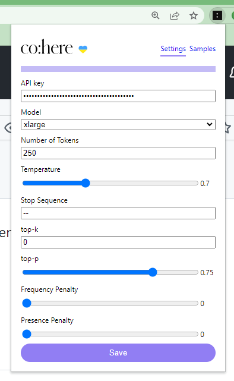

# 🤖 Google Mail - Cohere.ai

> @note: based on [@danimelchor](https://github.com/danimelchor) work, check it [here](https://github.com/danimelchor/gpt3-email)

## Getting started

### 👷‍♀️ Build

1. Clone the repository and install depenedencies

```bash
$ npm clone git@github.com:tomtobac/cohere-email.git
$ cd cohere-email
$ npm install
```

2. Build the extension

```bash
$ npm run build
```

### 🎒 Load

1. type `chrome://extensions/` the Chrome navbar or go to `Three dots (top right)` > `Settings` > `extensions`

2. Enable "Developer mode" in top right corner

3. Click on Load unpacked extension and select the `dist` folder which was generated by the step 2 in #Build

### 👨‍🏫 Usage

1. Once you have it loaded, you should see an icon next to your extension menu.

2. Click on the icon and a menu should appear, please enter your `api key`. You can get it from [here](https://dashboard.cohere.ai/api-keys). You can test it out with trial api key.

3. Navigate to [Google Mail](https://mail.google.com/) and click on "Compose", click again into the body of the email. After writing your command, as the example bellow 👇, you can click on "Co:here" button and it will generate a text based in your command.

4. Any error with the api will be printed in the body of the email too

## 📸 Screenshots

|                                                     |                                                  |
| --------------------------------------------------- | ------------------------------------------------ |
|               |              |
|   |  |
|  |                                                  |

### 🧪 todos

1. build: create a release version so users don't need build step
1. feat: add tooltip with an explanation of every setting
1. feat: allow more than one stop_sequence
1. refactor: tests
